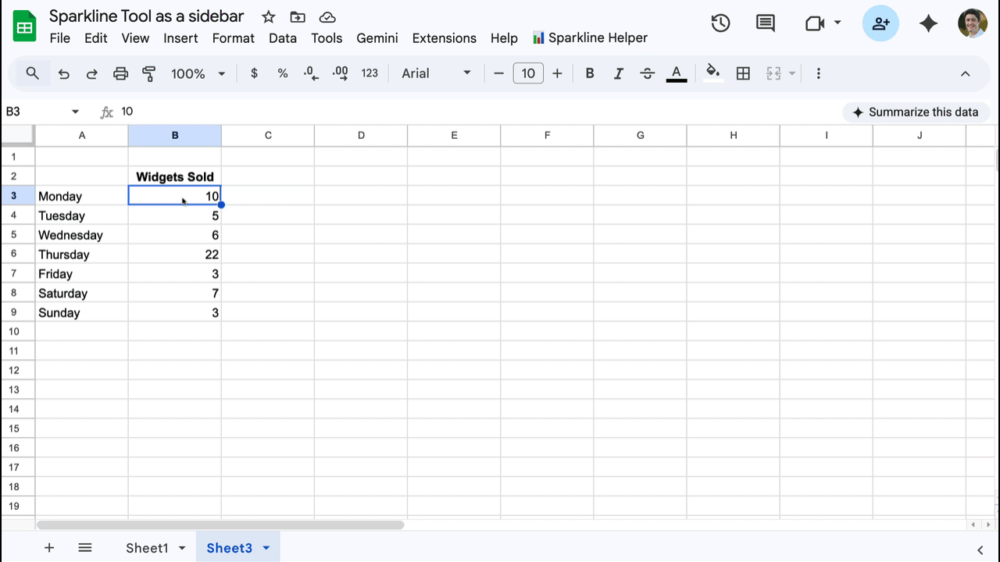

## Sparkline Helper for Google Sheets

A professional-grade Sidebar tool for Google Sheets that allows you to visually design and insert complex [SPARKLINE functions](https://www.benlcollins.com/spreadsheets/sparklines-in-google-sheets/) with real-time data previews.

### ✨ Key Features

* **Persistent Sidebar**: Stays open while you navigate between different sheets.
* **Live Data Preview**: Automatically fetches your actual sheet data to visualize the chart before you insert it.
* **Full Customization**: Supports all four sparkline types: **Line, Bar, Column, and Winloss**.
* **Advanced Bar Charts**: Support for up to 9 distinct color segments (`color1` through `color9`).
* **Collapsible Sections**: Clean interface with toggleable menus for Axes, Scaling, and Styling.
* **Mode-less Interaction**: Click and select ranges in the sheet and hit "Get" to pull cell references instantly.

---

### 🚀 Installation & Setup

1. **Open Google Sheets**: Open the spreadsheet where you want to use the tool.
2. **Open Apps Script**: Go to `Extensions` > `Apps Script`.
3. **Create Files**:
* Paste the provided backend code.
* Click the **+** icon, select **HTML**, name it `sidebar`, and paste the provided UI code.

4. **Save & Authorize**: Click the Save icon (floppy disk). Select the `onOpen` function and click **Run** to authorize the script permissions.
5. **Refresh**: Refresh your Google Sheet. You will see a new menu: **📊 Sparkline Tools**.

---

### 📖 How to Use

1. Click **📊  Sparkline Tools** > **Open Sparkline Helper**.
2. **Select Data**: Highlight a range of numbers in your sheet and click the **Get** button next to **Data Range**.
3. **Choose Output**: Click the cell where you want the chart to appear and click **Get** next to **Target Cell**.
4. **Customize**:
* Toggle between chart types.
* Expand sections like **Line Styling** or **Bar Colors** to change hex colors.
* The **Visual Preview** box will update in real-time based on your actual data.

5. **Insert**: Click the **Insert** button. The sidebar will insert the formula and close automatically.

---

### 🛠 Technical Details

* **Backend**: Google Apps Script (.gs)
* **Frontend**: HTML5, Tailwind CSS, JavaScript (Vanilla)
* **Preview Engine**: HTML5 Canvas API

---

### 👨💻 Local Development (Optional)

This project is compatible with **Clasp**. To develop locally:

1. Install Clasp: `npm install -g @google/clasp`
2. Clone the project: `clasp clone "YOUR_SCRIPT_ID"`
3. Push changes: `clasp push`
